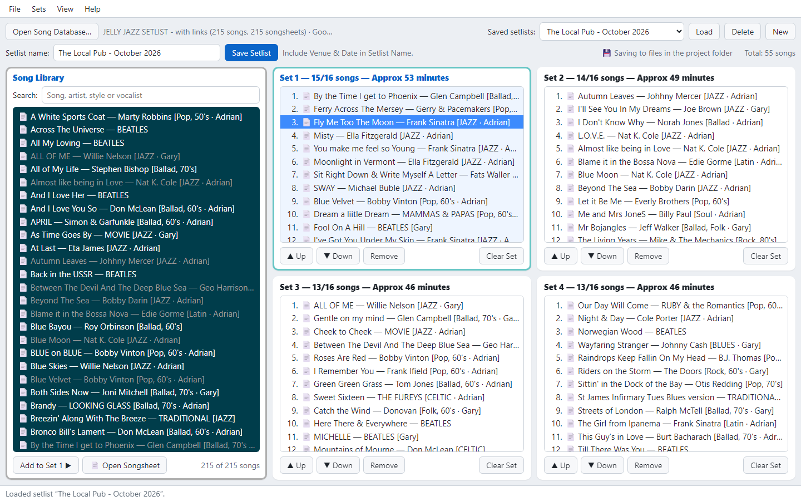

  

<h1 align="center">JJ's Musicians Setlist Organiser — Browser Edition</h1>

  Build, reorder, save and print gig setlists from your song spreadsheet, 
  with one-click access to each song's PDF songsheet. 
  Runs in any modern desktop browser: Chrome, Edge, Firefox or Safari.

  <b><a href="https://sunflowerguy.github.io/jjs-setlist/">▶ Open JJ's Setlist in your browser</a></b>
  &nbsp;·&nbsp;
  <a href="https://github.com/SunflowerGUY/jjs-setlist/releases/latest/download/JJs-Setlist-Browser-Edition.zip">Download for Windows, Mac &amp; Linux</a>

> **Use it online** at the link above: nothing to install. Your setlists are kept in your browser; use *File ▸ Export* to keep copies.
> **Or download it** to keep settings and setlists as files on your own computer (see *Getting started*).
> The original desktop app (Windows, macOS, Linux) lives at [SunflowerGUY/JJ-s-Musicans-Setlist-Organiser](https://github.com/SunflowerGUY/JJ-s-Musicans-Setlist-Organiser).

---

## Features

- **4 sets of up to 16 songs**, with the current set clearly highlighted and each set's approximate running time (about 3½ minutes a song).
- **Drag and drop** from the library into any set, within a set, between sets, or back to the library to remove. Buttons and keyboard shortcuts do the same.
- **Song database on Google Drive**: *File ▸ Song Database Settings* takes the Drive share link of your spreadsheet. The app can load the latest copy each time it opens. If Drive can't be reached, it uses the copy kept in the browser, with a clear orange **⚠ BACKUP** notice. *(Needs the app opened from a web address. See below.)*
- **Song library from Excel** (`.xlsx`) **or CSV**, including links embedded behind song names. Instant search across song name, artist, style and vocalist. Songs already in the setlist are greyed out.
- **Songsheet links**: songs with a link show 📄. Click the icon, or double-click a set song, to open its songsheet.
- **Save and load named setlists** (e.g. *"Venue Name - March 2027"*). If a setlist's songs aren't in the loaded song database, they're marked ⚠ in orange and you're told which database it was made with. Right-click one and choose **Replace with…** to swap it for another song in the same place. The closest matches (same artist, similar title) are listed first.
- **Same setlist files as the desktop app**: export a setlist as `.json` and drop it in the desktop app's `setlists` folder, or import the desktop app's setlists here.
- **Print or Save as PDF**: landscape A4, aligned columns, a set is never split across pages, page numbers in the footer. Also prints the song list (or just the songs matching a search).
- **Export** a setlist as text or CSV, and the song database as CSV with the web links written out.
- **Adjustable text size and colours**: *View ▸ Songlist & Setlist Colours* gives a live preview and a readability (contrast) check.
- **Online accounts** (needed on the website; optional for the copy on your own computer): each person signs in with **any email address and a password** (no Gmail needed), or with Google, and gets their own song library, settings and setlists, kept separate from everyone else's. Works from any computer. *(Needs a free Firebase project. See **Online accounts** below.)*
- **Saves to real files** when started with `Start JJ's Setlist.bat`: settings go in `config.json` and setlists in the `setlists` folder, the same files the desktop app uses. The song library and the setlist on screen are also remembered, so a reload or closed tab loses nothing.
- **Template generators**: *Help ▸ Create Template Spreadsheet…* (or *…CSV…*) makes a ready-to-fill song list with the right headings and example rows, then shows the next steps. With the helper running, it's saved in the project folder and **Open it in Excel** opens it for you.
- **Built-in help** (*Help* menu, or F1): the basics, keyboard shortcuts, full guides to setting up your song spreadsheet or CSV file, and your online account.
- **Drag files onto the window**: a spreadsheet opens as the song database, and `.json` files are imported as setlists.

---

## Getting started

**Online:** open **https://sunflowerguy.github.io/jjs-setlist/** and bookmark it. Nothing to install. The website is **for members only**: it shows just the sign-in window until you sign in (new members need an invitation code, see **Online accounts** below). Your settings and setlists are then kept in your account.

**On your own computer**, with settings and setlists kept as files: download [the zip](https://github.com/SunflowerGUY/jjs-setlist/releases/latest/download/JJs-Setlist-Browser-Edition.zip), unzip it, and start it with the launcher for your computer. A small window opens (the **helper**), and the app opens in your web browser at **`http://localhost:8765/`**. Bookmark that address.

| System | Start it with | Notes |
|---|---|---|
| **Windows** | Double-click **`Start JJ's Setlist.bat`** | |
| **Mac** | Double-click **`Start JJ's Setlist.command`** | The first time only: right-click it ▸ **Open** ▸ **Open** (macOS asks because it didn't come from the App Store). A Terminal window is the helper window. |
| **Linux** | **`./start-jjs-setlist.sh`** in a terminal, or double-click it and choose *Run* | `./start-jjs-setlist.sh --install` adds **JJ's Setlist** to the applications menu (`--uninstall` removes it). |

Then:

1. **Keep the helper window open** while you use the app (minimise it if you like). Close it when you've finished.
2. **File ▸ Open Song Database…** to choose your spreadsheet, or set up the Google Drive copy (below). Your saved setlists in `setlists` appear straight away.

Next time, start the launcher again. If it's already running, it just opens the app. The bookmark works whenever the helper is running.

The helper needs **Python 3.8 or newer** and nothing else. It uses only Python's standard library, and only this computer can connect to it. If Python is missing, the launcher says how to install it. On a Mac, accepting the offer to install the *command line developer tools* is enough. `READ ME FIRST.txt` has the same steps for people you send the app to.

**Without the helper:** you can still double-click `web/index.html`. Everything works except the Google Drive copy, but settings and setlists are then kept in the browser only, not in the files. The label next to the song total shows which is in use: *💾 Saving to files in the project folder* or *Saving in this browser only*.

This is a **desktop** tool for planning gigs, made for a computer screen with a mouse and keyboard. It isn't designed for phones or tablets.

### Song database on Google Drive

1. In Google Drive, share the spreadsheet as **Anyone with the link** and copy the link (*Share ▸ Copy link*).
2. In the app: **File ▸ Song Database Settings (Google Drive)…**, paste the link, press **Test link**, then **Save**.
3. Choose which to use:
   - **The Google Drive copy first**: the latest version is loaded each time the app opens. If Google Drive can't be reached (e.g. no internet), the copy kept in the browser is used and marked **⚠ BACKUP** in orange.
   - **The spreadsheet I open on this computer**: Drive is used only when no song database is loaded, or when you choose *File ▸ Load Song Database from Google Drive*.

To update the spreadsheet, use *Manage versions ▸ Upload new version* in Google Drive, so the link stays the same. Both uploaded Excel files and native Google Sheets work, and songsheet links embedded behind song names are kept.

> ⚠️ **Google Drive needs the app started with `Start JJ's Setlist.bat`** (or opened from an `https://` site). Google refuses downloads into a page opened by double-clicking `index.html`, and the app tells you so if you try.

---

## Using the app

1. Click a set to make it current (coloured frame and blue title), then **double-click** library songs to add them, or drag them in.
2. Reorder with drag and drop, **Alt+↑ / Alt+↓**, or the **▲ Up / ▼ Down** buttons.
3. Type a name (include venue and date) and **Save Setlist** (Ctrl+S).
4. **File ▸ Print / Save as PDF** (Ctrl+P). Choose the printer, or *Save as PDF*, in the browser's print window.

### Keyboard shortcuts

| Action | Windows & Linux | Mac |
|---|---|---|
| Open song database | Ctrl+O | ⌘O |
| Save setlist | Ctrl+S | ⌘S |
| Print setlist / Save as PDF | Ctrl+P | ⌘P |
| Find song | Ctrl+F | ⌘F |
| Go to Set 1–4 / library | Alt+1…4 / Alt+L | ⌥1…4 / ⌥L |
| Move song up / down | Alt+↑ / Alt+↓ | ⌥↑ / ⌥↓ |
| Move the selection | ↑ / ↓, Home / End | ↑ / ↓, Home / End |
| Add library song to current set | Enter or double-click | Enter or double-click |
| Open songsheet (set song) | Enter or double-click | Enter or double-click |
| Remove song from set | Delete | delete |
| Song menu (Open Songsheet, Move, Replace with…, Remove, Add to Set) | Right-click, or the Menu key / Shift+F10 | Right-click (or Control-click) |
| Clear the search | Esc (in the search box) | Esc |
| Text size | View menu, or browser zoom | View menu, or browser zoom |

**Different from the desktop app:** Ctrl+1–4 and Ctrl+L switch browser tabs and jump to the address bar, so sets use **Alt** instead. **Ctrl+P prints the setlist.** It no longer opens a songsheet.

---

## Your song spreadsheet

The library is read from the **first worksheet** of an Excel workbook (or a CSV). Row 1 holds the headings. Any order works, capitals don't matter, and extra columns are ignored:

| Heading | Required | Also accepted |
|---|---|---|
| **SONG NAME** | ✅ | Title, Song, Song Title, Name, Track |
| **Artist** | | Band, Performer, Original Artist |
| **Style** | | Genre, Type |
| **Vocalist** | | Singer, Vocals, Vocal, Lead Vocal |
| **Songsheet** | | Link, URL, PDF, Sheet, Chart |

**Songsheet links** can be:

- **embedded behind the song name** in Excel (select the cell, **Ctrl+K**, paste the link). This is the neatest option, `.xlsx` only.
- a `=HYPERLINK("url", "Song name")` formula, or
- written out in a **Songsheet** column. This also works in CSV files.

**Google Drive links work best.** Links to PDF files on your computer work when written relative to the `web` folder (e.g. `../3-temp-songs/Mountains of Mourne.pdf`).

> ⚠️ **Save as an Excel Workbook (`.xlsx`).** Saving as CSV throws away every embedded link. If you need a CSV, use **File ▸ Export Song Database as CSV (with web links)**.

---

## Where data is kept

The app picks one of three, shown by the label next to the song total:

| What | ☁ Signed in to an online account | 💾 Started with the launcher (helper) | `index.html` double-clicked |
|---|---|---|---|
| Saved setlists | **In your account**, from any computer | **`setlists\*.json`** in the project folder, the same files as the desktop app | This browser only |
| Colours, text size, Google Drive link | **In your account** | **`config.json`** in the project folder, shared with the desktop app's settings | This browser only |
| Song library | **In your account** | Kept in the browser (reloaded from Google Drive or the spreadsheet) | This browser only |
| The setlist on screen | Kept in the browser, per account. Cleared on sign-out | Kept in the browser, restored after a reload even if it wasn't saved | This browser only |

`config.json` uses the desktop app's names for the colours (`library_colours`) and the Google Drive link (`backup_url`, `drive_first`), so the two editions share them. The browser's text size is kept separately (`web_font_size`), because the desktop app measures text in points.

Setlists kept in the browser only can be moved with *File ▸ Export This Setlist (.json)* and *File ▸ Import Saved Setlists*. Importing while the helper is running saves them into `setlists\`.

---

## Online accounts

Optional. Turn them on and people sign in with **any email address and a password**, or with Google, from the **account button** at the top right. Signing out clears that person's copy from the browser.

**By invitation, with bands.** Signing up needs an **invitation code** from the administrator, and the code also says which **band** the person joins. On the Sign in window, new people type the code under *New here?*. It shows the band's name. Then they choose an email and password. People without a code can **Request an invitation code** (name and email), which the administrator sees and answers by hand.

- **A band's members share one song library and one set of saved setlists**, with full access. Everyone also keeps their **own private setlists**, and switches between them and their band(s) with the list at the top right. Colours and text size stay personal; a band's Google Drive link is shared.
- **The administrator** (account menu ▸ *Bands & invitation codes*) creates bands (names that are the same apart from spaces, capitals or punctuation, like *Jelly Jazz* / *The Jelly-Jazz*, are caught), copies a band's invitation to send, **revokes** the code once everyone has joined (members keep access), makes new codes, and removes members. *Invitation requests* lists who has asked, with a button to email them the band's invitation.
- **Nobody can see anything they shouldn't:** the database rules (`firestore.rules`) give a login made without a code no access at all, keep each person's own setlists private, let only a band's members into the band, and let only the administrator manage bands, codes and requests.

It runs on **Firebase** (Google's free service for this; the free plan easily covers a group of friends). To set it up, once:

1. At **console.firebase.google.com**, sign in with your Google account and **Create a project** (e.g. `jjs-setlist`), with Google Analytics off.
2. **Authentication ▸ Get started ▸ Sign-in method:** enable **Email/Password** and **Google**.
3. **Firestore Database ▸ Create database:** location closest to you, e.g. **australia-southeast2 (Melbourne)**, *production mode*. Then **Rules:** replace the text with the contents of **`firestore.rules`** and **Publish**.
4. **Project settings ▸ General ▸ Your apps ▸ Web (`</>`):** register an app, copy its `firebaseConfig` values into **`web/firebase-config.js`** (instructions inside).
5. When the app is hosted online (e.g. GitHub Pages), add its address under **Authentication ▸ Settings ▸ Authorized domains**. `localhost` is there already.
6. **Make yourself the administrator:** sign up once (or use an existing account), find your **User UID** under **Authentication ▸ Users**, then in **Firestore Database ▸ Data** click **Start collection**: collection ID `admins`, document ID = your User UID, one field `email` (string) = your email address. Do this **before** publishing the rules, or your own account is shut out like a stranger's.

With `web/firebase-config.js` left as `null`, accounts are off and the app works exactly as before.

**Testing without the real project:** `.firebase-test/Start Firebase Emulator.bat` runs a pretend Firebase on this PC (it needs Java, and installs the Firebase tools the first time). With the helper running, open `http://localhost:8765/?emulator`. Everything in the pretend Firebase disappears when its window closes. The made-up test accounts are in `.firebase-test/test-accounts.json`.

## How it works

Plain HTML, CSS and JavaScript, with no build step. It's a port of the desktop app's `jjs_setlist.py`.

- [SheetJS](https://sheetjs.com/) 0.18.5 reads `.xlsx` files, including hyperlinks and `HYPERLINK()` formulas.
- [SortableJS](https://sortablejs.github.io/Sortable/) 1.15.2 handles drag and drop with mouse, touch and pen.

Both are bundled in `web/lib/` (copied from cdnjs and checked against its published hashes), so nothing loads from the internet.

## Sharing it with your band (Windows, Mac and Linux)

Double-click **`Make Package.bat`** (or run `python make_package.py`). It makes **`packages/JJs Setlist - Browser Edition.zip`**, a single zip that works on all three systems:

- the app, the helper and the three launchers, plus `READ ME FIRST.txt` with simple steps for each system;
- your song spreadsheet, your saved setlists, and a `config.json` with just the **Google Drive link**, so the song database loads from Drive straight away (your colours and text size aren't included).

The zip records **Unix file permissions and line endings**, so the Mac and Linux launchers stay double-clickable / runnable after unzipping. Send the zip itself: if it's unzipped and re-zipped on Windows, those permissions are lost (`READ ME FIRST.txt` explains the one-line fix, `chmod +x`).

For sharing with anyone, **`Make Package.bat --public`** (or `python make_package.py --public`) makes `JJs Setlist - Browser Edition (public).zip`: the app only, with no spreadsheet, setlists or Drive link.

---

## Project files

| File / folder | Purpose |
|---|---|
| `Start JJ's Setlist.bat` | **Start here on Windows.** Runs the helper and opens the app in your browser |
| `Start JJ's Setlist.command` | The same, for a Mac |
| `start-jjs-setlist.sh` | The same, for Linux (`--install` adds a menu entry) |
| `READ ME FIRST.txt` | Short start-up steps for each system (goes in the package) |
| `make_package.py`, `Make Package.bat` | Make the zip for Windows, Mac and Linux (see above) |
| `serve.py` | The helper: serves the app at `http://localhost:8765/` and saves `config.json` and `setlists/*.json` (Python 3.8+, standard library only) |
| `web/firebase-config.js` | Online accounts: your Firebase project's settings (`null` = accounts off) |
| `firestore.rules` | Online accounts: who may read and write what (paste into Firebase) |
| `web/index.html` | The page |
| `web/app.js` | The app |
| `web/style.css` | Layout, colours and the print layout |
| `web/lib/` | Bundled SheetJS, SortableJS and Firebase (accounts; only loaded when switched on) |
| `web/icon.png`, `web/logo.png` | Browser-tab icon and About logo (from `ARTWORK/`) |
| `.github/workflows/pages.yml` | Publishes `web/` to GitHub Pages whenever it changes |
| `ARTWORK/` | Logo and icon artwork |
| `docs/` | Screenshots |

**Kept on your own computer, never in the repository** (`.gitignore` only lets the files above in):

| File / folder | Purpose |
|---|---|
| `config.json` | Your settings: colours, text size, Google Drive link (made by the helper) |
| `setlists/` | Your saved setlists (made by the helper) |
| your song spreadsheet (`.xlsx` / `.csv`) | Your song database |
| `packages/` | The zips made by `Make Package.bat` |
| `.firebase-test/` | Pretend Firebase for testing online accounts |

## Support

JJ's Musicians Setlist Organiser is free and open source. If it's useful to you, you can buy us a coffee ☕. Any amount, entirely optional:
**[paypal.me/jellyjazzsoftware](https://paypal.me/jellyjazzsoftware)** (also in the app: *Help ▸ Support JJ's Setlist*).

## Licence

Released under the [MIT Licence](LICENSE): free to use, copy, change and share, including in your own projects, as long as the copyright notice goes with it.

## Credits

Brought to you by **JELLY JAZZ**.  
Vibe coding by **Adrian Newington** — [github.com/SunflowerGUY](https://github.com/SunflowerGUY) — built together with [Claude Code](https://claude.com/claude-code).
